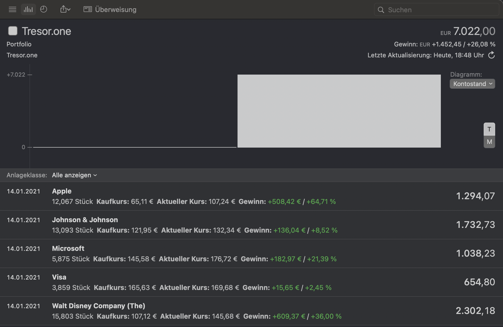

# MoneyMoney Tresor.one

Fetches portfolio from https://tresor.one

## Setup

* Download Tresor.one extension (TresorOne.lua)
* In MoneyMoney app open "Help" Menu and hit Show database in finder" (https://moneymoney-app.com/extensions/#installation)
* Copy TresorOne.lua in extensions folder
* In MoneyMoney app open "Preferences" > "Extensions" and make sure TresorOne shows up (to use unsigned extension uncheck "verify digital signatures of extensions" at the bottom)

### Add Account

* Use your portfolio identifier as the username, you will find the identifier at the end of the url (https://app.tresor.one/p/5f55425d139fc90007978e75)
* You need no password (you can use "123", save the password)

## Known Issues and Limitations

* Your portfolio must be public until Tresor.one will release an API for third party applications
